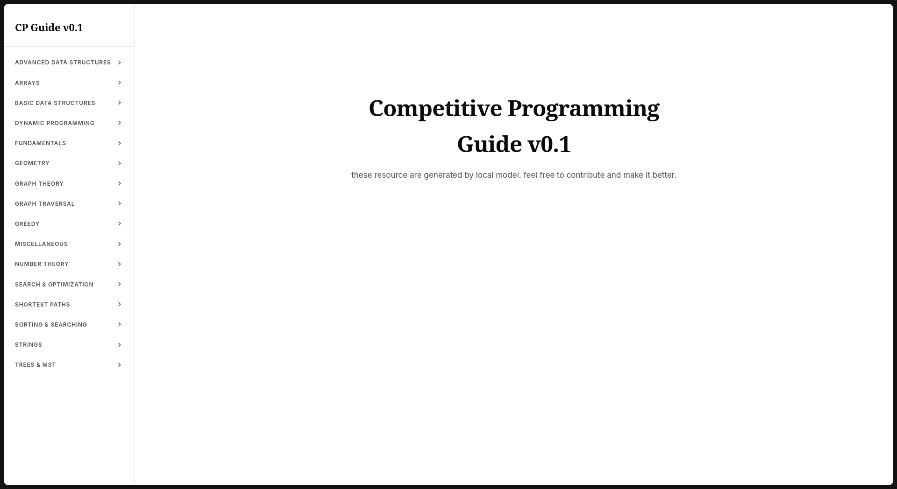
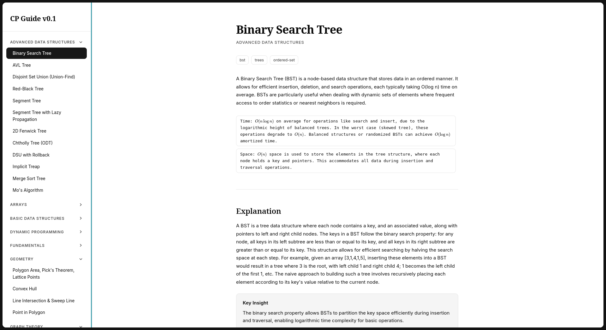

# cp-gpre
### competitive programming - guide and problem recommendation engine

## feautures
building one stop solution for competitive programming . uses local llm to make resources .

## usage

- data/topics.json -> list of algorithm/topics useful for cp
- core/model/ -> has instructions for local llm
- core/pipeline/localModel.py -> goes through all the topics in topics.json and gives this to local llm and makes db.json with all the content

- core/practice/ProblemList.py -> makes json file for all problems in codeforces and cses

- app.py -> runs a flask server app and displays content from db.json

## screenshot

## to-do list

- [ ] problem recommendation system
- [ ] webpage for problem recommendation system
- [ ] make users statistics
- [ ] for each topic show other articles from web 
- [ ] make db.json better
- [ ] make a rag system
